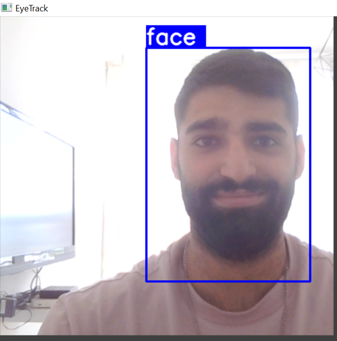
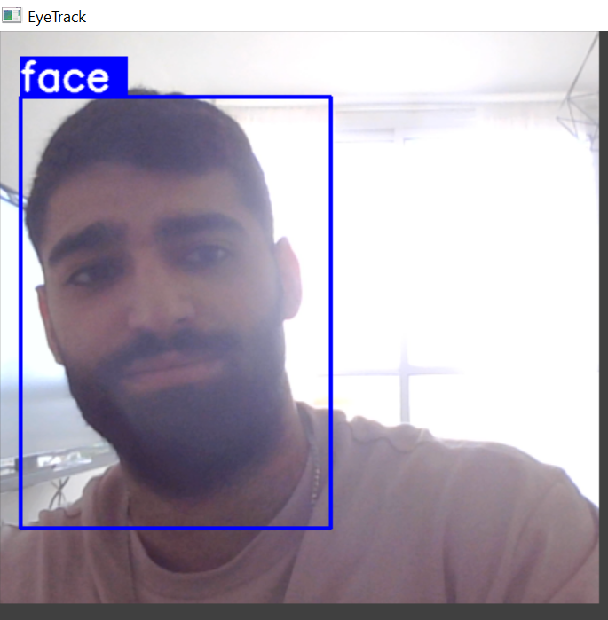
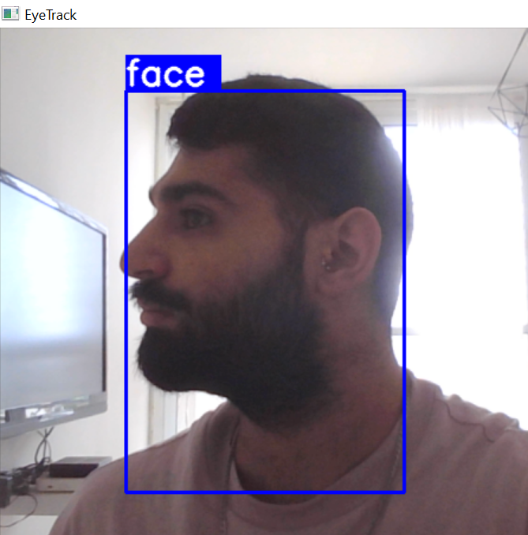

# Face Detection by Avinoam David

## About the Project
- This is a Real-Time Face-Detector Project based on user inputs. It features an Easy and Interactive Guide to taking self-made photos and feeding them to the detector training session.
- This project was made by me after taking several courses regarding both practical and theorem behind Computer Vision fields such as (to name a few) Convolutional Neural Networks, Image Proccessing Tools, Object Detection Tools.
- The project integrates both Classification and Regression (Prediction) models useage.
I made the project to test and display my ability to put my learnings into practice.
- Images handling done with OpenCV
- Labeling done with "labelme"
- model handled with TensorFlow

## Some Runtime Examples:
Bad Lighting &nbsp; &nbsp; &nbsp; &nbsp; &nbsp; &nbsp; &nbsp; &nbsp; &nbsp; &nbsp; &nbsp; &nbsp; &nbsp; &nbsp; &nbsp; &nbsp; &nbsp; &nbsp; &nbsp; &nbsp; While Moving &nbsp; &nbsp; &nbsp; &nbsp; &nbsp; &nbsp; &nbsp; &nbsp; &nbsp; &nbsp; &nbsp; &nbsp; &nbsp; &nbsp; &nbsp; Various Positions

 
    
    
    

### Walkthrough:
The project implements a complete process of creating a working real-time object detector,
demonstrated using face as the key object (although capable with any object):
1. Prepping Data:
- taking photos
- labeling with "labelme" software
- partitioning to train, val, and test
- augmenting to enhance dataset
2. Building A network:
- Using VGG16 netwrok for Classification and Integrating a self written Loss Function for Regression.
- The integration is made to be able to classify a face and predict the indicator box (around faces) co-ordinates
3. Experimenting with variables to improve the model (epochs, types of augmentations, adjustments of the loss function, etc)
4. Back-Testing and Visualising the results

## Train and Use it yourself!
- Simply install all dependencies specificed in FaceDetection.ipynb (Set an environment if necessary)
- Run every cell in the correct order. **When meeting a cell with a title !Practipicate!** - follow the instructions. they are ment so that the model will learn based on your very self!

  
